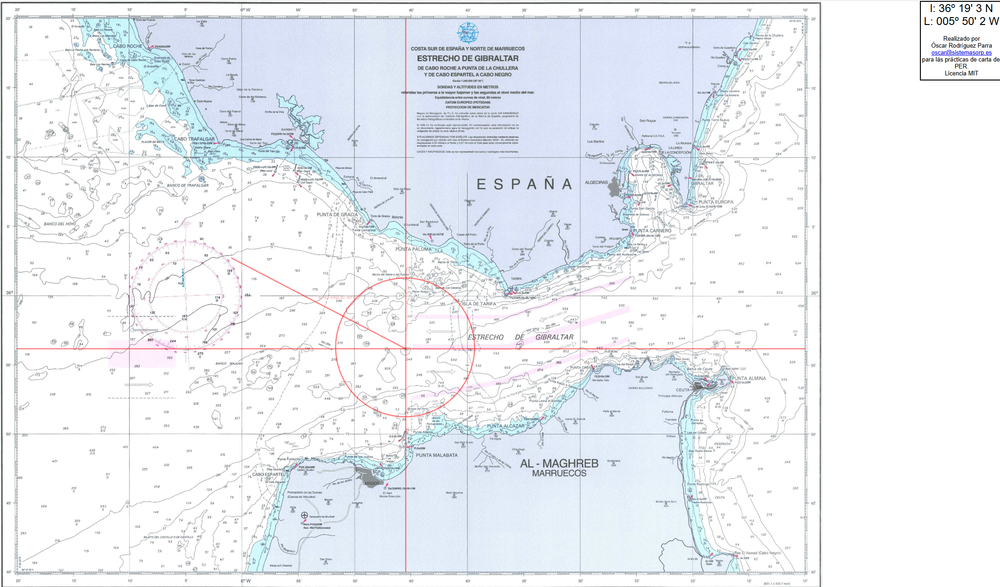

# CartoPER - Carta L105 del PER

Esta aplicación web es una herramienta interactiva diseñada para realizar ejercicios prácticos sobre la **Carta L105 del Estrecho de Gibraltar**, utilizada comúnmente en las enseñanzas para la obtención del título de **Patrón de Embarcaciones de Recreo (PER)**.

El proyecto permite a los estudiantes y usuarios trazar rumbos, calcular distancias y posicionarse en la carta de manera digital, simulando el trabajo tradicional sobre papel.

## Características

*   **Visualización Interactiva**: Navegación por la carta náutica con funciones de *zoom* y desplazamiento (arrastrar).
*   **Posicionamiento**: Muestra las coordenadas exactas (**Latitud** y **Longitud**) de la posición del cursor en tiempo real.
*   **Herramientas de Trazado**:
    *   **Líneas Verticales y Horizontales**: Para marcar meridianos o paralelos de referencia.
    *   **Enfilaciones**: Trazado de líneas que unen dos puntos de referencia.
    *   **Oposiciones**: Trazado de líneas de posición basadas en puntos opuestos.
    *   **Demoras**: Dibujo de líneas de demora dado un ángulo específico.
    *   **Distancias Circulares**: Trazado de círculos de distancia dado un radio en millas.
    *   **Cálculo de Rutas**: Herramienta para medir la distancia (en millas) y el rumbo (en grados) entre dos puntos (Distancia recta y demora).
*   **Gestión de Dibujo**:
    *   Selección de **colores** (Rojo, Verde, Azul, Naranja) para diferenciar trazos.
    *   Funciones para **borrar** el último trazo o limpiar todo el mapa.

## Uso

Para utilizar la aplicación, simplemente abre el archivo `source/index.html` en cualquier navegador web moderno. No requiere instalación ni servidor backend.

## Autor

Realizado por **Óscar Rodríguez**.
Contacto: [oscar@sistemasorp.es](mailto:oscar@sistemasorp.es)

## Licencia

Este proyecto se distribuye bajo la **Licencia MIT**. Consulta el archivo `LICENSE` para más detalles.
